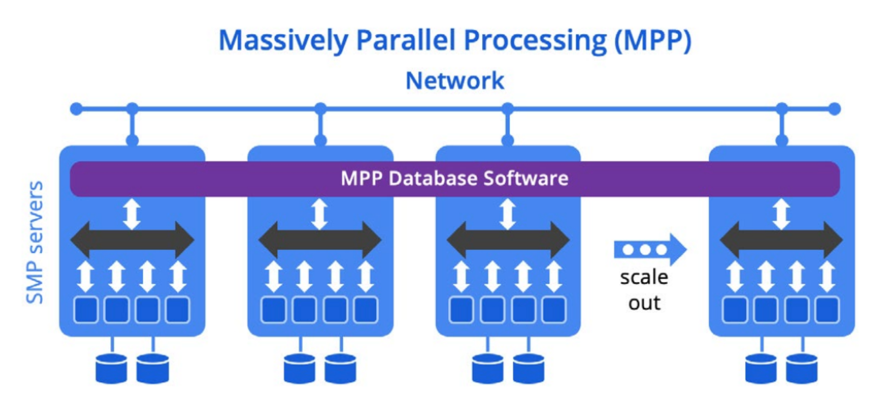

---
hide:
  - navigation
  - toc
tags:
  - Architecture
---
# :material-database: Architecture

Kinetica is a distributed, vectorized, memory-first, columnar database with tiered storage
that is optimized for high speed and performance – particularly on streaming analytics and
geospatial workloads.

Kinetica has been uniquely designed for fast and flexible analytics on large volumes of
changing data with incredible performance.

## Database Architecture

### Scale-out Architecture

Kinetica has a distributed architecture that has been designed for data processing at scale.
A standard cluster consists of identical nodes run on commodity hardware.
A single node is chosen to be the head aggregation node.

A cluster can be scaled up at any time to increase storage capacity and processing power,
with near-linear scale processing improvements for most operations.
Sharding of data can be done automatically, or specified and optimized by the user.

### Distributed Ingest & Query

Kinetica uses a shared-nothing data distribution across worker nodes.
The head node receives a query and breaks it down into small tasks that can be spread across worker nodes.
To avoid bottlenecks at the head node, ingestion can also be organized in parallel by all the worker nodes.
Kinetica is able to distribute data client-side before sending it to designated worker nodes.
This streamlines communication and processing time.

For the client application, there is no need to be aware of how many nodes are in the cluster,
where they are, or how the data is distributed across them!

### Column Oriented

Columnar data structures lend themselves to low-latency reads of data.
But from a user's perspective, Kinetica behaves very similarly to a standard relational database –
with tables of rows and columns and it can be queried with SQL or through APIs.
Available column types include the standard base types (int, long, float, double, string, & bytes),
as well as numerous sub-types supporting date/time, geospatial, and other data forms.

### Vectorized Functions

Vectorization is Kinetica’s secret sauce and the key feature that underpins its blazing fast performance.

Advanced vectorized kernels are optimized to use vectorized CPUs and GPUs for faster performance.
The query engine automatically assigns tasks to the processor where they will be most performant.
Aggregations, filters, window functions, joins and geospatial rendering are some of the capabilities
that see performance improvements.

### Memory-First, Tiered Storage

Tiered storage makes it possible to optimize where data lives for performance and cost.
Recent data (such as all data where the timestamp is within the last 2 weeks) can be held in-memory,
while older data can be moved to disk, or even to external storage services.

Kinetica operates on an entire data corpus by intelligently managing data across GPU memory,
system memory, SIMD, disk / SSD, HDFS, and cloud storage like S3 for optimal performance.

Kinetica can also query and process data stored in data lakes, joining it with data managed by Kinetica
in highly parallelized queries.

### Performant Key-Value Lookup

Kinetica is able to generate distributed key-value lookups, from columnar data, for high-performance and concurrency.
Sharding logic is embedded directly within client APIs enabling linear scale-out as clients can lookup data directly
from the node where the data lives.

----
