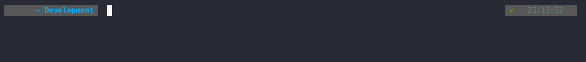
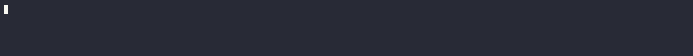

---
hide:
  - navigation
  - toc
tags:
  - Getting Started
  - Installation
---
# :material-shovel: Preparation & Prerequisites

Checks & steps to ensure a smooth installation.

!!! note "Obtain a Kinetica License Key"
    A product license key will be required for install.
    Please contact [Kinetica Support](mailto:support@kinetica.com "Kinetica Support Email") to request a trial key.
    
    Failing to provide a license key at installation time will prevent the DB from starting.

## Preparation and prerequisites

!!! warning "Free Resources"
    Your Kubernetes cluster version should be >= 1.22.x and have a minimum of 8 CPU, 8GB Ram and  
    SSD or SATA 7200RPM hard drive(s) with 4X memory capacity.

??? info "GPU Support"
    For GPU enabled clusters the cards below have been tested in large-scale production environments and 
    provide the best performance for the database.
    
    |       GPU       |         Driver          |
    |:---------------:|:-----------------------:|
    | **P4/P40/P100** | **525.X** _(or higher)_ |
    | **V100**        | **525.X** _(or higher)_ |
    | **T4** | **525.X** _(or higher)_ |   
    | **A10/A40/A100** | **525.X** _(or higher)_ | 

### Kubernetes Cluster Connectivity
Installation requires [**Helm3**](https://v3.helm.sh/docs/intro/install/ "Helm Installation Instructions") and access to an on-prem or CSP managed
Kubernetes cluster.
and the Kubernetes CLI [**kubectl**](https://kubernetes.io/docs/tasks/tools/#kubectl "Kubernetes CLI Installation Instructions").

The context for the desired target cluster must be selected from your `~/.kube/config` file and set via the
`KUBECONFIG` environment variable or `kubectl ctx` (if installed). Check to see if you have the correct context with,

``` sh title="show the current kubernetes context"
kubectl config current-context
```

and that you can access this cluster correctly with,

``` sh title="list kubernetes cluster nodes"
kubectl get nodes
```

??? example "Get Nodes"
    

If you do not see a list of nodes for your K8s cluster the helm installation will not work.
Please check your Kubernetes installation or access credentials (kubeconfig).

--8<-- "docs/Advanced/kinetica_images_list_for_airgapped_environments.md"

[//]: # (:octicons-x-circle-fill-24:)

### Label the Kubernetes    Nodes

Kinetica requires some of the Kubernetes Nodes to be labeled as it splits some of the 
components into different deployment 'pools'. This enables different physical node types to be present
in the Kubernetes Cluster allowing us to target which Kinetica components go where.

e.g. for a GPU installation some nodes in the cluster will have GPUs and others are CPU only.
We can put the DB on the GPU nodes and our infrastructure components on CPU only nodes.

=== ":simple-intel: :simple-amd: :simple-arm: cpu"

    The Kubernetes cluster nodes selected to host the Kinetica infrastructure pods 
    i.e. non-DB Pods require the following label `app.kinetica.com/pool=infra`.

    

    ``` shell title="Label the Infrastructure Nodes"
        kubectl label node k8snode1 app.kinetica.com/pool=infra
    ```

    whilst the Kubernetes cluster nodes selected to host the Kinetica DB Pods 
    require the following label `app.kinetica.com/pool=compute`.

    ``` shell title="Label the Database Nodes"
        kubectl label node k8snode2 app.kinetica.com/pool=compute
    ```

    ---

=== ":simple-nvidia: gpu"

    The Kubernetes cluster nodes selected to host the Kinetica infrastructure pods 
    i.e. non-DB Pods require the following label `app.kinetica.com/pool=infra`.

    

    ``` shell title="Label the Infrastructure Nodes"
        kubectl label node k8snode1 app.kinetica.com/pool=infra
    ```

    whilst the Kubernetes cluster nodes selected to host the Kinetica DB Pods 
    require the following label `app.kinetica.com/pool=compute-gpu`.

    ``` shell title="Label the Database Nodes"
        kubectl label node k8snode2 app.kinetica.com/pool=compute-gpu
    ```

    --8<-- "docs/GettingStarted/note_additional_gpu_sqlassistant.md"

    ---

!!! warning "Pods Not Scheduling"
    If the Kubernetes are not labeled you may have a situation where Kinetica pods
    not schedule and sit in a 'Pending' state.

## Install the kinetica-operators chart

This chart will install the Kinetica K8s operators together with a default configured database and workbench UI.

### Add the Kinetica chart repository

Add the repo locally as *kinetica-operators*:

``` sh title="Helm repo add"
helm repo add kinetica-operators https://kineticadb.github.io/charts/latest
```

??? example "Helm Repo Add"
    

### Obtain the default Helm values file

For the generic Kubernetes install use the following values file without modification.
Advanced users with specific requirements may need to adjust parameters in this file.

``` sh title="Helm values.yaml download"
wget https://raw.githubusercontent.com/kineticadb/charts/{{helm_chart_version}}/kinetica-operators/values.onPrem.k8s.yaml
```

### Determine the following prior to the chart install

!!! info inline end "Default Admin User"
    the default admin user in the Helm chart is `kadmin` but this is configurable.
    Non-ASCII characters and typographical symbols in the password must be escaped with a "\". For
    example, `--set dbAdminUser.password="MyPassword\!"`

1. Obtain a LICENSE-KEY as described in the introduction above.
2. Choose a PASSWORD for the initial administrator user
3. As the storage class name varies between K8s flavor and/or there can be multiple,
   this must be prescribed in the chart installation.
   Obtain the DEFAULT-STORAGE-CLASS name with the command:

<br/>

``` sh title="Find the default storageclass"
kubectl get sc -o name 
```

??? example "List StorageClass"
    

use the name found after the /, For example, in `storageclass.storage.k8s.io/local-path` use "local-path" as the
parameter.

??? warning "Amazon EKS"
    If installing on Amazon EKS [_See here_](eks.md#ebs-csi-driver)

#### Planning access to your Kinetica Cluster 

??? question "Existing Ingress Controller?"
    If you have an existing Ingress Controller in your Kubernetes cluster and do not want
    Kinetica to install an `ingresss-nginx` to expose it's endpoints then you can disable
    `ingresss-nginx` installation in the `values.yaml` by editing the file and setting
    `install: true` to `install: false`: -
    
        ```` yaml
        nodeSelector: {}
        tolerations: []
        affinity: {}
    
        ingressNginx:
            install: false
        ````

---
